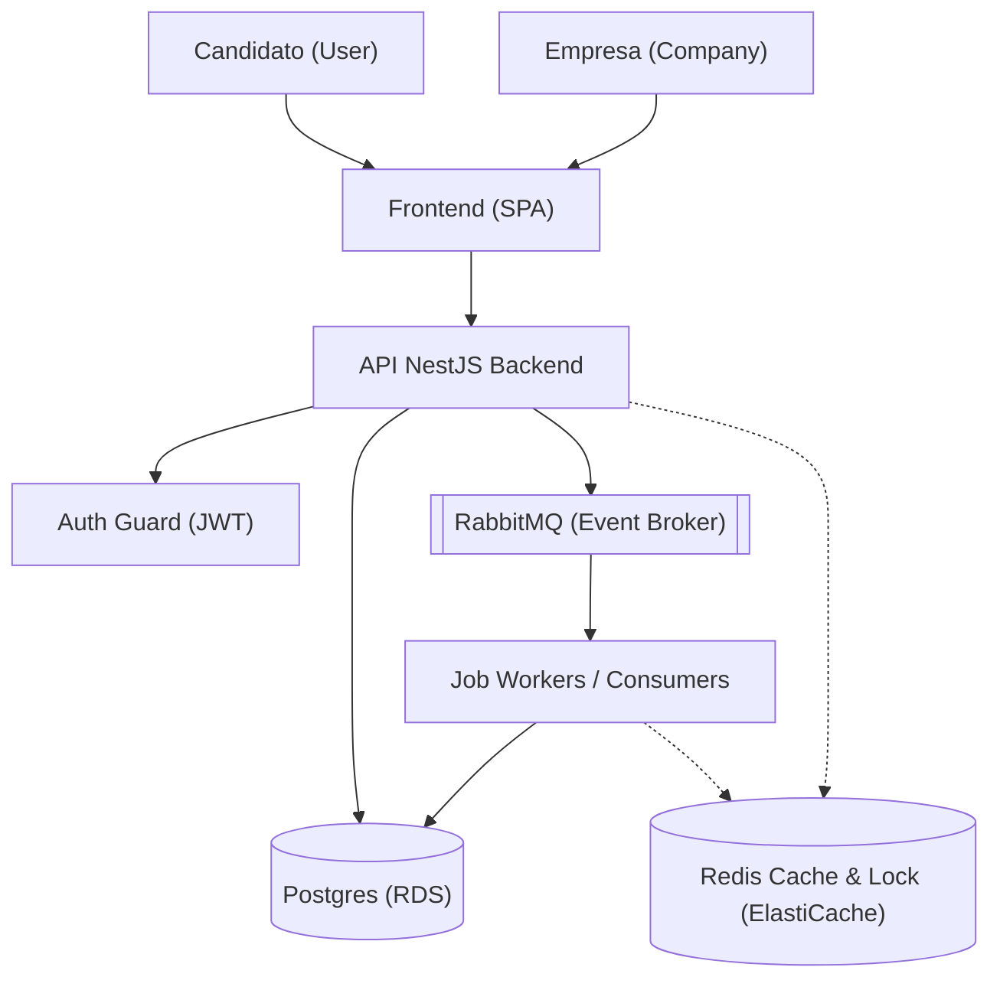
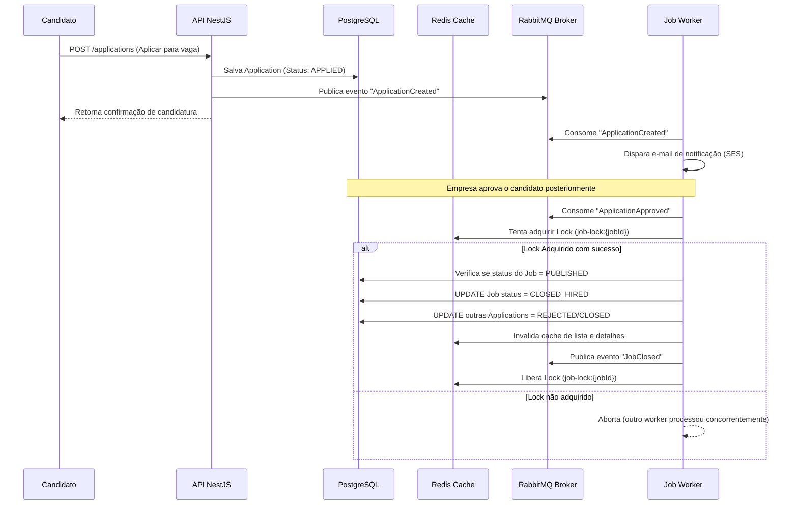

## 1. Visão geral do domínio

O sistema tem como objetivo permitir que **empresas** (`Company`) publiquem e gerenciem vagas de emprego, enquanto **usuários candidatos** (`User` / role `User`) podem visualizar e se candidatar a essas vagas (`Application`). Opcionalmente, há suporte para o papel de **administrador** (`Admin`) para governança.

- **Papéis principais** (mapeados no enum `Role` do banco):
  - **Company**: Organização que publica e gerencia vagas. Associada 1:1 a uma `Account`.
  - **User** (candidato): Pessoa física que pesquisa vagas e se candidata. Associada 1:1 a uma `Account`.
  - **Admin**: Gerencia configurações globais, monitoramento e suporte.

- **Ciclo de vida da vaga** (entidade `Job`):
  1. **Criação / Rascunho** (`DRAFT`): A vaga é registrada no banco com dados básicos, visível apenas para a empresa criadora.
  2. **Publicação** (`PUBLISHED`): A vaga torna-se ativa e visível para listagem e candidatura por usuários candidatos.
  3. **Candidatura**: Candidatos realizam aplicações na vaga, gerando registros em `Application`.
  4. **Fechamento**:
     - Por **expiração** (`CLOSED_EXPIRED`): Ocorre após atingir a data limite (`expiresAt`).
     - Por **contratação/aprovação** (`CLOSED_HIRED`): Ocorre quando um candidato é aprovado, utilizando um **lock distribuído** para garantir consistência.

O projeto é estruturado em **NestJS** e **Prisma ORM**, integrado a **PostgreSQL** e **RabbitMQ** (via Microservices), com previsão de **Redis** para cache e locks distribuídos.

---

## 2. Requisitos de alto nível e status de implementação

- **Requisitos funcionais**:
  - **[Concluído] Publicar vaga**: Empresa autenticada cria, edita e publica vagas.
  - **[Concluído] Listar vagas**: Candidatos com role `User` visualizam vagas `PUBLISHED` com filtros (localidade, tipo de contrato, etc.).
  - **[Concluído] Candidatar-se**: Candidatos aplicam para vagas ativas (`PUBLISHED`).
  - **[Concluído] Autenticação e Autorização**: Login via JWT com controle de rotas por Roles (`company`, `user`, `admin`).
  - **[Concluído] Validações e Perfil**: Validação de CPF/CNPJ, suporte a avatar e configurações de painel.
  - **[Pendente] Fechamento automático por expiração**: Job Worker periódico (cron) para expirar vagas passadas da data de expiração.
  - **[Pendente] Fechamento por aprovação**: Fluxo acionado por evento onde a vaga passa para `CLOSED_HIRED`.
  - **[Pendente] Notificações assíncronas**: Envio de e-mails para empresa/candidato em eventos chave.
  - **[Concluído] Feedback Automático**: Envio de e-mail para não selecionados e log de auditoria.
  - **[Concluído] Monetização**: Integração com gateway de pagamentos e checkout para empresas/freelancers.
  - **[Concluído] Reputação**: Sistema de avaliação de 1 a 5 estrelas.
  - **[Concluído] Governança**: Painel de controle Web Admin, listagem geral, banimento e moderação.

- **Requisitos não funcionais**:
  - **[Concluído] Banco de dados relacional**: Postgres via Prisma para persistência de dados transacionais.
  - **[Concluído] Mensageria e Desacoplamento**: RabbitMQ configurado para recebimento assíncrono de eventos de criação de conta (`AccountCreated`).
  - **[Pendente] Escalabilidade / Cache**: Redis para leitura rápida de listagens (`job:list:{filtersHash}`) e detalhes (`job:detail:{jobId}`).
  - **[Pendente] Consistência / Concorrência**: Redis para lock distribuído em transição de fechamento de vaga (`job-lock:{jobId}`).

---

## 3. Arquitetura lógica

Estrutura interna atual dos componentes no backend (localizados em [src/](file:///C:/Users/User/Desktop/projects/hubb-vagas/src)):

- **API Backend (NestJS)**:
  - **AuthModule** ([auth/](file:///C:/Users/User/Desktop/projects/hubb-vagas/src/auth)): Estratégia JWT Passport para validação de tokens e guards de roles.
  - **AccountsModule** ([accounts/](file:///C:/Users/User/Desktop/projects/hubb-vagas/src/accounts)): CRUD de contas. Inclui o `AccountsConsumer` (RabbitMQ) e estratégias usando o Strategy Pattern (`ProfileCreationRegistry`) para criar perfis automáticos de `User` ou `Company` após a criação de uma `Account`.
  - **CompaniesModule** ([companies/](file:///C:/Users/User/Desktop/projects/hubb-vagas/src/companies)) & **UsersModule** ([users/](file:///C:/Users/User/Desktop/projects/hubb-vagas/src/users)): Gerenciamento de dados de perfil específicos de empresas e candidatos.
  - **JobsModule** ([jobs/](file:///C:/Users/User/Desktop/projects/hubb-vagas/src/jobs)): Lógica de negócio das vagas, validação de propriedade da vaga e fluxo de status.
  - **ApplicationsModule** ([applications/](file:///C:/Users/User/Desktop/projects/hubb-vagas/src/applications)): Lógica de candidatura dos usuários candidatos às vagas de emprego.
  - **InfraModule** ([infra/](file:///C:/Users/User/Desktop/projects/hubb-vagas/src/infra)):
    - **Prisma** ([infra/prisma/](file:///C:/Users/User/Desktop/projects/hubb-vagas/src/infra/prisma)): Configuração do Prisma Client, migrations e repositórios concretos implementando as interfaces de [repositories/](file:///C:/Users/User/Desktop/projects/hubb-vagas/src/repositories).
    - **Messaging** ([infra/messaging/](file:///C:/Users/User/Desktop/projects/hubb-vagas/src/infra/messaging)): Integração com RabbitMQ microservices.

---

## 4. Arquitetura física / AWS

A arquitetura física planejada para implantação em produção na AWS compreende:

- **Hospedagem da API**: API NestJS implantada em **AWS ECS Fargate** sob um **Application Load Balancer (ALB)**.
- **Banco de dados**: **Amazon RDS for PostgreSQL** para persistência estruturada e relacional.
- **Mensageria**: **Amazon MQ (RabbitMQ)** ou Cluster RabbitMQ em instâncias EC2.
- **Cache e Lock**: **Amazon ElastiCache for Redis** como cache de queries/vagas e gerenciador de locks.
- **Notificações**: **Amazon SES** para envio assíncrono de notificações de e-mail disparadas por workers.

---

## 5. Modelagem de dados (Esquema Prisma)

O banco de dados relacional é mapeado via Prisma ([schema.prisma](file:///C:/Users/User/Desktop/projects/hubb-vagas/src/infra/prisma/schema.prisma)):

- **`Account`**: Armazena e-mail, senha criptografada e o papel de acesso (`Role: User, Admin, Company`).
- **`Company`**: Detalhes da empresa (`name`, `cnpj`, `contact`), associada via chave estrangeira a uma `Account`.
- **`User`**: Perfil do candidato (`name`, `bio`), associado via chave estrangeira a uma `Account`.
- **`Job`**: Vagas de emprego. Contém localidade, tipo de contrato, requisitos, status (`DRAFT`, `PUBLISHED`, `CLOSED_EXPIRED`, `CLOSED_HIRED`), data de validade (`expiresAt`) e chave estrangeira para `Company`.
- **`Application`**: Relação de candidaturas entre um `User` e um `Job`. Possui status (`APPLIED`, `SCREENING`, `APPROVED`, `REJECTED`).
- **`JobStatusHistory`**: Histórico completo de auditoria das transições de status da vaga (`JobStatus`), registrando quem mudou, quando e o motivo.

---

## 6. Uso de Redis (Planejado)

O Redis será incorporado na camada de infraestrutura do NestJS para duas finalidades críticas:

- **Cache de Leitura Intensiva**:
  - `job:list:{filtersHash}`: Cache das listagens paginadas de vagas ativas com TTL padrão de 5 a 10 minutos.
  - `job:detail:{jobId}`: Cache das vagas mais acessadas individualmente.
  - *Invalidação automática*: Qualquer alteração na vaga (edição, fechamento, nova publicação) força a invalidação do cache de detalhe e das listas correlacionadas.

- **Lock Distribuído**:
  - Utilizado no fluxo de fechamento de vaga para prevenir condições de corrida ao aprovar candidatos concorrentes na mesma vaga.
  - Chave do lock: `job-lock:{jobId}` criada atomicamente via `SETNX` com TTL para prevenção de deadlocks.

---

## 7. Fluxos principais do sistema

### 7.1 Fluxo de publicação de vaga (Empresa)
1. A empresa autentica-se recebendo o token JWT.
2. Envia um POST/PUT para `/jobs` com os dados da vaga.
3. O `JobsService` persiste no banco Postgres. Se for publicada diretamente, o cache de listagem correspondente no Redis é invalidado.

### 7.2 Fluxo de candidatura (Candidato)
1. O usuário candidato busca vagas através de filtros. O backend tenta buscar do Redis (`job:list:{...}`). Em caso de cache miss, busca do Postgres e atualiza o Redis.
2. Ao se candidatar, envia POST para `/applications`. O sistema registra a candidatura em `Application` e publica o evento `ApplicationCreated` na exchange do RabbitMQ.
3. Um consumer assíncrono recebe o evento `ApplicationCreated` e encaminha a notificação via e-mail.

### 7.3 Fluxo de fechamento de vaga por contratação
1. Uma candidatura é marcada como aprovada pelo painel da empresa.
2. O sistema emite o evento `ApplicationApproved` no RabbitMQ.
3. O Worker de fechamento consome o evento e tenta adquirir o lock no Redis para a chave `job-lock:{jobId}`.
4. Se o lock for adquirido com sucesso:
   - Verifica se a vaga ainda está `PUBLISHED` no Postgres.
   - Atualiza o status da vaga para `CLOSED_HIRED` e o status das candidaturas.
   - Registra no histórico `JobStatusHistory`.
   - Invalida os caches do Redis associados a esta vaga.
   - Publica o evento `JobClosed` para notificações.
   - Libera o lock.

---

## 8. Diagramas em mermaid

### 8.1 Diagrama de Componentes Atual e Planejado

### 8.2 Diagrama de Sequência de Candidatura e Fechamento

---

## 9. Considerações de segurança e observabilidade

- **Segurança**:
  - Hashing de senhas com `bcrypt` antes de salvar no banco de dados.
  - Autenticação e autorização centralizadas via NestJS Guards (`JwtAuthGuard` e `RolesGuard`).
  - Strict mapping de payloads utilizando DTOs com validação via `zod`.

- **Observabilidade (Planejado)**:
  - Logs estruturados em formato JSON utilizando Winston ou NestJS logger padrão com transporte para AWS CloudWatch.
  - Métricas de consumo de filas e tempo de processamento dos workers.
  - Alarmes de erros recorrentes de processamento ou conexões de banco perdidas.
