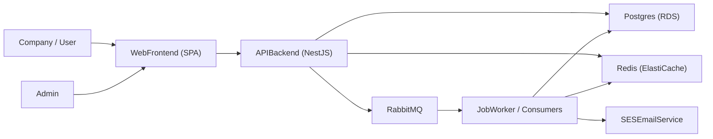
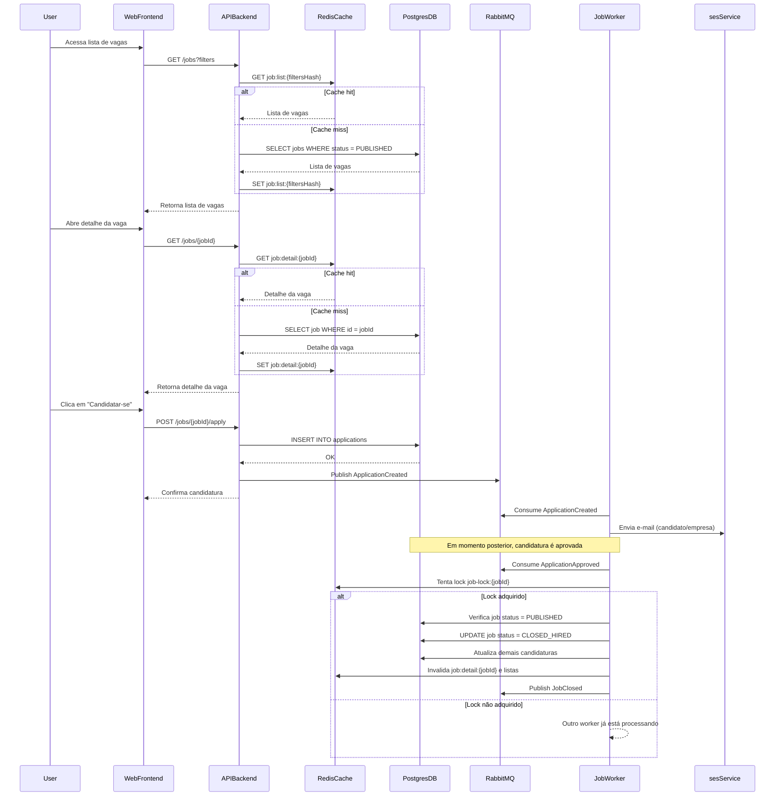

## 1. Visão geral do domínio

O sistema tem como objetivo permitir que **empresas** publiquem e gerenciem vagas de emprego, enquanto **usuários candidatos** (role `user`) podem visualizar e se candidatar a essas vagas. Opcionalmente, pode existir um perfil de **administração** para governança e apoio operacional.

- **Papéis principais**:
  - **Company**: organização que publica e gerencia vagas.
  - **User** (candidato): pessoa física que pesquisa vagas disponíveis e se candidata.
  - **Admin** (opcional): gerencia configurações globais, monitoramento e suporte.

- **Ciclo de vida da vaga** (entidade `job`):
  1. **Criação / rascunho** (`DRAFT`): empresa registra os dados básicos da vaga.
  2. **Publicação** (`PUBLISHED`): vaga fica visível para usuários com role `user`.
  3. **Interação / candidatura**: candidatos visualizam a vaga, se candidatam e podem ser avaliados.
  4. **Fechamento**:
     - Por **expiração de período** (`CLOSED_EXPIRED`).
     - Por **contratação de um candidato qualificado** (`CLOSED_HIRED`), garantindo via **lock distribuído** que apenas o primeiro qualificado efetivamente fecha a vaga.

O sistema é pensado como um projeto de **conhecimento/estudo**, mas com decisões arquiteturais alinhadas a práticas de produção (uso de Redis, Postgres, RabbitMQ e serviços AWS).

---

## 2. Requisitos de alto nível

- **Requisitos funcionais**:
  - **Publicar vaga**: empresa autenticada cria, edita e publica vagas.
  - **Listar vagas**: usuários autenticados com role `user` podem ver vagas publicadas com filtros básicos (localidade, tipo de contrato, senioridade etc.).
  - **Candidatar-se**: usuário com role `user` pode se candidatar a uma vaga publicada.
  - **Gerenciar vagas**: empresa consegue pausar/fechar vagas, ver candidatos associados e histórico de status.
  - **Fechamento automático**:
    - Por **expiração de data**.
    - Por **aprovação de candidato** (vaga muda para `CLOSED_HIRED`).
  - **Notificações básicas**: por exemplo, envio de e-mails para empresa/candidato em eventos importantes (candidatura recebida, vaga fechada).

- **Requisitos não funcionais**:
  - **Escalabilidade**:
    - Separação entre camadas (frontend, backend, banco, cache, mensageria).
    - Uso de **Redis** para cache de leitura intensiva (lista de vagas, detalhes).
    - Uso de **RabbitMQ** para descarregar trabalho assíncrono do backend.
  - **Disponibilidade**:
    - Infraestrutura em AWS com serviços gerenciados (`RDS`, `ElastiCache`, `CloudFront`, etc.).
    - Capacidade de rodar múltiplas instâncias da API/backend atrás de um balanceador.
  - **Segurança/autenticação**:
    - Autenticação (ex.: JWT, Cognito ou outro IdP).
    - Autorização baseada em roles (`company`, `user`, `admin`).
  - **Observabilidade**:
    - Logs centralizados (ex.: CloudWatch Logs).
    - Métricas e alarmes básicos para API, filas e workers.

---

## 3. Arquitetura lógica

Componentes principais em termos de blocos lógicos:

- **Frontend Web**:
  - Aplicação SPA (React, Vue, etc.) que consome a API.
  - Responsável por fluxos de login, listagem de vagas, candidatura e painel da empresa.

- **API Backend**:
  - Serviço (ex.: NestJS) expondo endpoints **REST/GraphQL**.
  - Responsável por:
    - Autenticação e autorização.
    - CRUD de empresas, usuários, vagas, candidaturas.
    - Validação de regras de domínio de alto nível.
    - Publicação de eventos em **RabbitMQ**.
    - Interação síncrona com **Postgres** e **Redis**.

- **Postgres**:
  - Banco transacional principal para:
    - `accounts`: dados centrais de autenticação e papéis de acesso (roles).
    - `companies`: dados das empresas (perfil associado a uma conta).
    - `users`: dados dos usuários/candidatos (perfil associado a uma conta).
    - `jobs`: dados das vagas.
    - `applications`: candidaturas associadas a vagas.
    - `job_status_history`: histórico de alterações de status da vaga.

- **Redis**:
  - **Cache** para:
    - Lista de vagas publicadas, com filtros comuns (paginadas).
    - Detalhes de uma vaga com alta leitura.
  - **Sessões / blacklists**:
    - Armazenamento de sessões de usuário ou blacklists de tokens JWT (dependendo da estratégia de auth).
  - **Lock distribuído obrigatório**:
    - Utilizado no fluxo de **fechamento de vaga ao aprovar candidato**.
    - Implementado com operações atômicas (ex.: `SETNX` + TTL) em chaves do tipo `job-lock:{jobId}`.
    - Desenhado para ser reutilizável em outras operações críticas futuras (ex.: outras transições de estado sensíveis).

- **RabbitMQ**:
  - Broker de mensagens para desacoplar a API backend de processos assíncronos.
  - Eventos de domínio principais:
    - `ApplicationCreated`: emitido quando uma candidatura é criada.
    - `ApplicationApproved` (ou equivalente): quando um candidato é aprovado.
    - `JobClosed`: quando uma vaga é fechada (por expiração ou contratação).
  - Facilita:
    - Envio de notificações (e-mail, webhooks).
    - Processamento de lógica de negócio assíncrona (fechamento de vaga, integrações externas).

- **Job Worker / Workers especializados**:
  - Serviços consumidores de filas/exchanges do RabbitMQ.
  - Responsáveis por:
    - Processar eventos `ApplicationCreated` (ex.: enviar e-mail de confirmação, notificar empresa).
    - Processar eventos `ApplicationApproved` com uso de **lock distribuído em Redis** para fechar vaga com segurança.
    - Processos de **fechamento por expiração** (via cron/timer).

---

## 4. Arquitetura física / AWS

Mapeamento dos blocos lógicos para serviços na AWS:

- **API Backend**:
  - Implantado em **ECS Fargate** ou **EC2**.
  - Exposto via **Application Load Balancer (ALB)**.

- **Banco de dados**:
  - **Amazon RDS for PostgreSQL** como banco relacional gerenciado.

- **Cache e lock distribuído**:
  - **Amazon ElastiCache for Redis** para cache e implementação dos locks distribuídos.

- **Frontend**:
  - Arquivos estáticos hospedados em **S3**, servidos ao público via **CloudFront**.

- **Mensageria (RabbitMQ)**:
  - RabbitMQ hospedado de forma gerenciada (quando disponível) ou em **EC2/ECS**.
  - Utilizado pela API para publicar eventos e por workers para consumo.

- **Workers / Processamento assíncrono**:
  - Serviços em **ECS** ou funções **AWS Lambda** que:
    - Consomem filas/exchanges do RabbitMQ.
    - Acessam Redis para locks e cache.
    - Persistem alterações em Postgres.

- **E-mails e notificações**:
  - **Amazon SES** pode ser usado para envio de e-mails, disparados pelos workers.

- **Observabilidade**:
  - **CloudWatch Logs** para logs de API e workers.
  - **CloudWatch Metrics/Alarms** para monitorar saúde da API, filas RabbitMQ (tamanho, taxa de consumo) e instâncias de banco/cache.

---

## 5. Modelagem de dados essencial (alto nível)

- **Tabelas principais**:
  - `accounts`:
    - Dados centrais de autenticação e autorização (e-mail, senha, role).
  - `companies`:
    - Dados cadastrais da empresa (nome, CNPJ, contato, etc.), com relacionamento 1:1 para `accounts`.
  - `users`:
    - Dados de usuários candidatos (nome, currículo, links), com relacionamento 1:1 para `accounts`.
  - `jobs`:
    - Dados da vaga: título, descrição, requisitos, empresa, localidade, tipo de contrato, data de expiração, status.
  - `applications`:
    - Registro de candidatura: referência ao usuário, vaga, data/hora, status da candidatura (ex.: `APPLIED`, `SCREENING`, `APPROVED`, `REJECTED`).
  - `job_status_history`:
    - Histórico de transições de status da vaga: quem fez a alteração, quando, motivo.

- **Estados de `job`**:
  - `DRAFT`: vaga ainda não publicada, apenas visível para a empresa.
  - `PUBLISHED`: vaga ativa e visível para usuários com role `user`.
  - `CLOSED_EXPIRED`: vaga fechada automaticamente por atingir data de expiração.
  - `CLOSED_HIRED`: vaga fechada porque um candidato foi contratado/aprovado, respeitando o lock distribuído para garantir consistência.

---

## 6. Uso de Redis

O Redis é um componente central tanto para **performance** (cache) quanto para **consistência** (lock distribuído):

- **Cache de leitura**:
  - Lista de vagas publicadas (com filtros mais usados).
  - Detalhes de uma vaga, especialmente para vagas muito acessadas.
  - Chaves de exemplo:
    - `job:list:{filtersHash}` → lista paginada de IDs de vaga.
    - `job:detail:{jobId}` → dados serializados da vaga.

- **Sessões / tokens**:
  - Armazenar sessões de usuário (caso necessário) ou blacklists de tokens JWT.
  - Chaves de exemplo:
    - `session:{sessionId}`, `jwt:blacklist:{jti}`.

- **Lock distribuído obrigatório**:
  - Utilizado para proteger o fluxo de **fechamento de vaga quando um candidato é aprovado**.
  - Implementado com operação atômica (por exemplo, `SETNX` com TTL) em uma chave:
    - `job-lock:{jobId}`.
  - Fluxo típico de uso:
    1. Worker recebe evento de candidatura aprovada.
    2. Worker tenta adquirir o lock em `job-lock:{jobId}`.
    3. Se o lock for adquirido:
       - Verifica se a vaga ainda está `PUBLISHED`.
       - Atualiza status para `CLOSED_HIRED` em Postgres.
       - Registra histórico em `job_status_history`.
       - Invalida caches (`job:detail:{jobId}`, listas de vagas relacionadas).
       - Publica evento `JobClosed` em RabbitMQ.
       - Libera o lock (se necessário, dependendo da estratégia de TTL).
    4. Se não conseguir o lock:
       - Outro worker já está processando ou já processou o fechamento.
  - O padrão de chave e a lógica são pensados para serem **reutilizados futuramente** em outras operações críticas (ex.: atualizações de dados sensíveis de vaga).

---

## 7. Fluxos principais do sistema

### 7.1 Fluxo de publicação de vaga (empresa)

1. Empresa autentica na aplicação (role `company`).
2. Frontend chama a API para criar/editar vaga.
3. API grava/atualiza registro em `jobs` no Postgres, inicialmente como `DRAFT` ou diretamente `PUBLISHED` (conforme regra).
4. Ao publicar ou atualizar vaga relevante:
   - API **invalida cache** de listagem de vagas no Redis (chaves `job:list:{filtersHash}`).
   - API opcionalmente pré-carrega cache de detalhe (`job:detail:{jobId}`).

### 7.2 Fluxo de listagem e candidatura (usuário)

1. Usuário autenticado com role `user` acessa tela de vagas.
2. Frontend chama endpoint de listagem de vagas:
   - API tenta ler lista de vagas publicadas do Redis (`job:list:{filtersHash}`).
   - Em caso de **cache miss**, lê do Postgres, monta resposta e **popula cache** no Redis com TTL adequado.
3. Usuário seleciona uma vaga específica:
   - API tenta ler detalhes em `job:detail:{jobId}` no Redis.
   - Em caso de miss, busca no Postgres, retorna para o cliente e popula cache.
4. Usuário clica em “Candidatar-se”:
   - API valida que a vaga está em `PUBLISHED` e que o usuário pode se candidatar.
   - Cria registro em `applications` no Postgres.
   - Publica evento `ApplicationCreated` em RabbitMQ.
   - Opcionalmente, invalida ou atualiza cache de métricas rápidas da vaga (ex.: número de candidatos).
5. Worker(es) consumindo `ApplicationCreated`:
   - Envia e-mail de confirmação para o candidato.
   - Notifica a empresa (e-mail, webhook, etc.), se desejado.

### 7.3 Fluxo de fechamento de vaga

- **Fechamento por expiração (`CLOSED_EXPIRED`)**:
  1. Um worker de agendamento (cron) verifica periodicamente vagas com data de expiração ultrapassada e status `PUBLISHED`.
  2. Atualiza o status dessas vagas para `CLOSED_EXPIRED` em Postgres.
  3. Registra em `job_status_history`.
  4. Invalida caches associados (`job:detail:{jobId}`, chaves de listagem relevantes).
  5. Publica evento `JobClosed` em RabbitMQ (motivo: expiração).

- **Fechamento por contratação (`CLOSED_HIRED`) com lock distribuído**:
  1. Em algum ponto do fluxo de avaliação (manual ou automatizado), uma candidatura é marcada como **aprovada**.
  2. API publica um evento `ApplicationApproved` (ou similar) em RabbitMQ, contendo `jobId` e `applicationId`.
  3. Um worker consumidor recebe o evento e tenta adquirir lock em Redis na chave `job-lock:{jobId}`.
  4. Se o lock for adquirido:
     - Confere em Postgres se a vaga ainda está `PUBLISHED`.
     - Se estiver, atualiza status para `CLOSED_HIRED`.
     - Atualiza `applications` (ex.: marca aquela candidatura como contratada, as demais como não selecionadas).
     - Registra histórico em `job_status_history`.
     - Invalida caches em Redis relacionados à vaga.
     - Publica evento `JobClosed` em RabbitMQ contendo o motivo (contratação) e o candidato.
  5. Se o lock não for adquirido:
     - Outro worker já está cuidando do fechamento para esse `jobId`, evitando condição de corrida.

---

## 8. Diagramas em mermaid

### 8.1 Diagrama de componentes (alto nível)

### 8.2 Diagrama de sequência – fluxo de candidatura com fechamento

---

## 9. Considerações de segurança e observabilidade

- **Segurança**:
  - Autenticação baseada em **tokens** (por exemplo, JWT), possivelmente integrando com um IdP como **AWS Cognito**.
  - Autorização por **roles**:
    - `company`: acesso a criação/edição de vagas e visualização de candidaturas às suas vagas.
    - `user`: acesso à listagem e candidatura.
    - `admin`: acesso ampliado para monitoramento e suporte.
  - Proteção de dados sensíveis (ex.: armazenar senhas com hashing forte, usar TLS end-to-end).

- **Observabilidade**:
  - Logs estruturados da API e workers enviados para **CloudWatch Logs**.
  - Métricas de:
    - Latência e taxa de erro da API (HTTP).
    - Tamanho e tempo de permanência de mensagens em filas do RabbitMQ.
    - Conexões e uso de recursos do Postgres e Redis.
  - Alarmes para:
    - Fila de mensagens crescendo sem consumo.
    - Erros recorrentes em workers.
    - Erros 5xx na API.

- **Resiliência**:
  - Uso de **retries** com backoff exponencial em consumidores RabbitMQ.
  - Dead-letter queues (ou exchanges específicas) para mensagens que falharam repetidamente.
  - Uso cuidadoso do TTL dos locks em Redis para evitar deadlocks em caso de falhas de worker.

Este blueprint serve como base para implementação incremental, mantendo o foco em **clareza arquitetural**, **uso de Redis, Postgres e RabbitMQ** e **cenário realista em AWS**, mesmo em um contexto de estudo.
