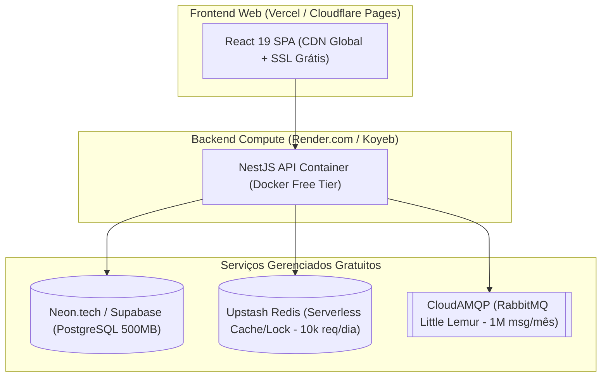

# Design Spec: Arquitetura Custo Zero (Free Tier) e Otimizações de Alta Performance

**Data:** 2026-07-29  
**Status:** Aprovado pelo Usuário  
**Objetivo:** Definir a arquitetura 100% gratuita (Custo R$ 0,00) e as estratégias de otimização de desempenho e leveza para o sistema **Hubb Vagas**.

---

## 1. Visão Geral e Objetivos de Negócio

O Hubb Vagas é um projeto de estudo e demonstração de arquitetura profissional que necessita rodar com **custo de infraestrutura igual a R$ 0,00**, sem sacrificar a velocidade, resiliência ou boas práticas de engenharia de software.

### Objetivos Chave:
1. **Zero Cost Infrastructure**: Migração dos conceitos da AWS para plataformas com *Free Tier* vitalício.
2. **Leveza e Baixa Latência**: Respostas de leitura em <20ms utilizando caching na borda (CDN Edge).
3. **Simplicidade Operacional**: Manter 100% do código existente em NestJS, Postgres (Prisma), Redis e RabbitMQ.
4. **Prevenção de Cold Starts**: Manter contêineres gratuitos ativos sem custos.

---

## 2. Topologia de Infraestrutura Custo 0,00 R$

Serão mapeados e suportados dois modelos de implantação:

### Modelo 1: Managed Serverless Free Tier (Principal)

- **Frontend Hosting**: Vercel / Cloudflare Pages (100% grátis, deploystacks contínuos via GitHub, HTTPS automático).
- **Backend API**: Render.com / Koyeb (100% grátis com suporte a Docker Containers).
- **Banco de Dados**: Neon.tech ou Supabase (PostgreSQL Serverless nativo com pooling ativado).
- **Redis Cache & Locks**: Upstash Redis (10.000 comandos diários gratuitos com conexão HTTP/TCP).
- **RabbitMQ Broker**: CloudAMQP (Plano *Little Lemur* com 1.000.000 de mensagens mensais).

---

### Modelo 2: Oracle Cloud Always Free (Self-Hosted Docker)

Para ambientes com necessidade de zero cold-start e recursos computacionais pesados totalmente grátis:
- **VM Spec**: Oracle Cloud Always Free ARM Ampere A1 (4 vCPUs, 24GB de RAM, 200GB SSD).
- **Execução**: `docker-compose.yml` único contendo a API NestJS, PostgreSQL 16, Redis 7 e RabbitMQ 3.12.
- **Frontend**: Servido via Vercel conectando à IP/Domínio apontado para a VM Oracle.

---

## 3. Estratégias Arquiteturais de Alta Performance e Leveza

### 3.1 Edge Cache & HTTP Headers (`Cache-Control`)
- **Implementação**: Interceptor/Guard no NestJS aplicável a rotas públicas (`GET /jobs`, `GET /jobs/:id`).
- **Headers**: `Cache-Control: public, max-age=60, s-maxage=300, stale-while-revalidate=600`.
- **Efeito**: Requisições repetidas de listagem são servidas diretamente pela CDN da Vercel na borda (edge) em <15ms, sem acionar o container Node.js.

### 3.2 Projeção Enxuta de Dados no Prisma ORM
- **Implementação**: Ajustar os repositórios Prisma (`JobsRepository`) para usar a propriedade `select` explícita em chamadas de listagem.
- **Efeito**: Evita carregar campos grandes como `description` ou históricos pesados na busca de vagas paginada, economizando ~70% de tráfego de dados e alocação de RAM.

### 3.3 Optimistic UI Updates (UX Instantânea)
- **Implementação**: TanStack Query no React configurado com mutações otimistas para ações comuns (ex: Candidatar-se, Favoritar Vaga).
- **Efeito**: A interface do usuário reflete a mudança de estado imediatamente, enquanto o POST trafega de forma assíncrona.

### 3.4 Rotina Anti-Sleep (Prevent Cold Starts)
- **Implementação**: GitHub Actions workflow cron (ou *cron-job.org*) realizando um `GET /health` a cada 10 minutos na URL do Render/Koyeb.
- **Efeito**: Garante que a API permaneça aquecida na RAM, eliminando pausas de 30 segundos ao abrir o app.

---

## 4. Plano de Atualização da Documentação do Projeto

Estas definições serão incorporadas aos documentos principais do repositório:
- `docs/ARCHITECTURE.md`: Adição da seção "Arquitetura Custo Zero (Free Tier Stack)".
- `architectureBP.MD` & `GEMINI.MD`: Atualização da topologia AWS para incluir a alternativa Free-Tier gerenciada.
- `.antigravity.md` & `ToDo.MD`: Mapeamento das rotinas de otimização de performance e headers de edge cache.

---

## 5. Plano de Verificação

1. **Build & Typecheck**: Garantir que o monorepo compila com `npm run build`.
2. **Testes Unitários & Integração**: Garantir que a suíte Jest/Vitest passe com `npm test`.
3. **Commit & PR**: Enviar as atualizações de especificação para a branch `update-docs`.
